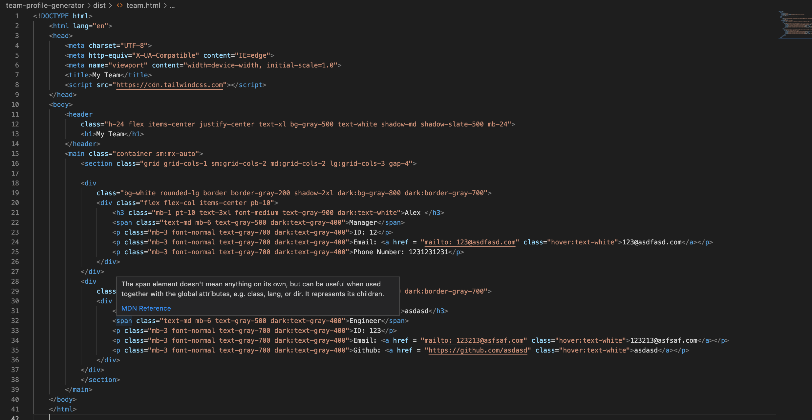

# Week10-Homework

# Team Profile Generator

## Description 

Week 10 Homework at Adelaide Uni Coding Bootcamp was to create a node.js application to ask a bunch of questions about a business structure and create a new html document with this relevent data. 
The is to hava a my team webpage that deplays a manager and all the other employees.

## Table of contents 

- [Resources](#resources) 
- [Screenshots](#screenshots) 
- [Contact](#contact)

## Resources

> [Walkthrough Video]()

> [Github Repo](https://github.com/mckayjalex/team-profile-generator)

## Screenshots 

Webpage

Code

Command Line

Command Line Tests (Jests)

## Contact

GitHub: [GitHub](https://github.com/mckayjalex) Email: [alexjosephmckay@gmail.com](alexjosephmckay@gmail.com)